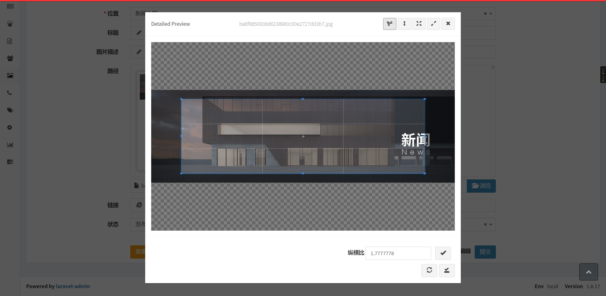

cropper extension for laravel-admin
======

这是一个`laravel-admin`扩展，基于`Encore\Admin\Form\Field\Image`开发，
将`cropperjs`集成进`laravel-admin`的表单图片组件中，选择上传图片后可进行自由裁切；

## 截图



## 安装

```bash
composer require igwen6w/cropper
```

然后使用artisan 命令发布资源
```bash
php artisan vendor:publish --provider='Igwen6w\Cropper\CropperServiceProvider' --force
```

## 配置

在`config/admin.php`文件的`extensions`，加上属于这个扩展的一些配置
```php

    'extensions' => [

        'cropper' => [
        
            // 如果要关掉这个扩展，设置为false
            'enable' => true,
        ]
    ]
```

## 使用

在form表单中使用它：
```php
$form->cropper('content','label');
```
默认模式是自由剪裁模式，可使用 aspectRation 方法，设置裁切比例；
```php
$form->cropper('content','label')->aspectRation($aspect_ration);
```

License
------------
Licensed under [The MIT License (MIT)](LICENSE).